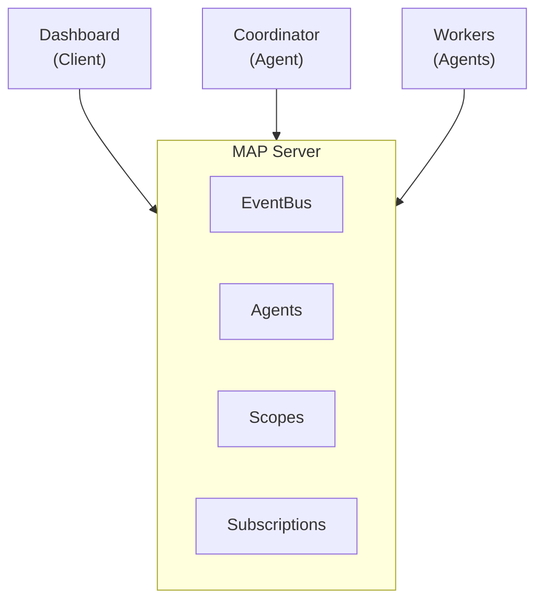

# Full Integration
{: .no_toc }

A complete application demonstrating all MAP concepts.
{: .fs-6 .fw-300 }

## Table of contents
{: .no_toc .text-delta }

1. TOC
{:toc}

---

## Overview

This example brings together all MAP concepts:
- Server with authentication
- Multiple agent types with roles
- Scopes for collaboration
- Client dashboard with real-time updates
- Error handling and reconnection

---

## Architecture



---

## Server with Authentication

```typescript
// server.ts
import { MAPServer } from "@multi-agent-protocol/sdk/server";
import { WebSocketServer } from "ws";
import jwt from "jsonwebtoken";

const JWT_SECRET = process.env.JWT_SECRET || "development-secret";

const server = new MAPServer({
  name: "ProductionServer",
  version: "1.0.0",

  auth: {
    required: process.env.NODE_ENV === "production",
    methods: ["bearer", "none"],

    validate: async (credentials) => {
      if (credentials.method === "none") {
        return {
          success: true,
          principal: { id: "anonymous", claims: { role: "guest" } },
        };
      }

      if (credentials.method === "bearer") {
        try {
          const payload = jwt.verify(credentials.credential!, JWT_SECRET);
          return {
            success: true,
            principal: {
              id: payload.sub as string,
              claims: payload,
            },
          };
        } catch {
          return {
            success: false,
            error: { code: "invalid_credentials", message: "Invalid token" },
          };
        }
      }

      return { success: false, error: { code: "method_not_supported", message: "Unknown method" } };
    },
  },

  middleware: [
    // Logging
    async (method, params, ctx, next) => {
      const start = Date.now();
      console.log(`[${ctx.session.id}] → ${method}`);
      const result = await next();
      console.log(`[${ctx.session.id}] ← ${method} (${Date.now() - start}ms)`);
      return result;
    },
  ],

  additionalHandlers: {
    "stats/overview": async () => ({
      agents: server.agents.list().length,
      scopes: server.scopes.list().length,
      connections: server.connections.size,
      uptime: process.uptime(),
    }),
  },
});

// Track statistics
let messagesProcessed = 0;
server.on("message.sent", () => messagesProcessed++);

const wss = new WebSocketServer({ port: 8080 });

wss.on("connection", (ws, req) => {
  console.log(`New connection from ${req.socket.remoteAddress}`);
  server.accept(websocketToStream(ws)).start();
});

// Graceful shutdown
process.on("SIGTERM", async () => {
  console.log("Shutting down...");
  await server.close({ timeout: 10000 });
  wss.close();
  process.exit(0);
});

console.log("Server running on ws://localhost:8080");
```

---

## Coordinator Agent

```typescript
// coordinator.ts
import { AgentConnection } from "@multi-agent-protocol/sdk";

interface Task {
  id: string;
  type: string;
  data: unknown;
  submitter: string;
  assignedTo?: string;
  status: "pending" | "assigned" | "completed" | "failed";
  createdAt: number;
}

async function main() {
  const agent = new AgentConnection(await connect(), {
    name: "Coordinator",
    role: "coordinator",
    metadata: {
      version: "1.0.0",
      capabilities: ["task-routing", "load-balancing"],
    },
    reconnect: { enabled: true },
  });

  await agent.connect();
  console.log("Coordinator started");

  // Create work scope
  const workScope = await agent.createScope({
    name: "work-queue",
    metadata: { maxWorkers: 10 },
  });

  // State
  const workers = new Map<string, { busy: boolean; tasksCompleted: number }>();
  const tasks = new Map<string, Task>();
  const pendingQueue: string[] = [];

  // Subscribe to events
  const sub = await agent.subscribe({
    eventTypes: ["scope.joined", "scope.left", "agent.unregistered"],
  });

  // Event processing
  (async () => {
    for await (const event of sub) {
      handleEvent(event);
    }
  })();

  function handleEvent(event: any) {
    switch (event.type) {
      case "scope.joined":
        if (event.data.scopeId === workScope.id && event.data.agentId !== agent.id) {
          workers.set(event.data.agentId, { busy: false, tasksCompleted: 0 });
          console.log(`Worker joined: ${event.data.agentId}`);
          processQueue();
        }
        break;

      case "scope.left":
      case "agent.unregistered":
        if (workers.has(event.data.agentId)) {
          workers.delete(event.data.agentId);
          console.log(`Worker left: ${event.data.agentId}`);
          // Reassign their tasks
          reassignTasks(event.data.agentId);
        }
        break;
    }
  }

  // Message handling
  agent.onMessage(async (message) => {
    const { type } = message.payload;

    switch (type) {
      case "submit-task":
        handleSubmitTask(message);
        break;

      case "task-result":
        handleTaskResult(message);
        break;

      case "get-status":
        await sendStatus(message.from);
        break;
    }
  });

  function handleSubmitTask(message: any) {
    const task: Task = {
      id: `task-${Date.now()}-${Math.random().toString(36).slice(2)}`,
      type: message.payload.taskType,
      data: message.payload.data,
      submitter: message.from,
      status: "pending",
      createdAt: Date.now(),
    };

    tasks.set(task.id, task);
    pendingQueue.push(task.id);
    console.log(`Task ${task.id} queued`);

    processQueue();
  }

  function handleTaskResult(message: any) {
    const { taskId, success, result, error } = message.payload;
    const task = tasks.get(taskId);

    if (task) {
      task.status = success ? "completed" : "failed";

      const worker = workers.get(message.from);
      if (worker) {
        worker.busy = false;
        if (success) worker.tasksCompleted++;
      }

      // Notify submitter
      agent.send({
        to: { agentId: task.submitter },
        payload: {
          type: "task-completed",
          taskId,
          success,
          result,
          error,
        },
      });

      console.log(`Task ${taskId}: ${task.status}`);
      processQueue();
    }
  }

  function processQueue() {
    while (pendingQueue.length > 0) {
      const availableWorker = [...workers.entries()].find(([, w]) => !w.busy);
      if (!availableWorker) break;

      const taskId = pendingQueue.shift()!;
      const task = tasks.get(taskId)!;
      const [workerId, worker] = availableWorker;

      task.status = "assigned";
      task.assignedTo = workerId;
      worker.busy = true;

      agent.send({
        to: { agentId: workerId },
        payload: { type: "task", task },
      });

      console.log(`Task ${taskId} assigned to ${workerId}`);
    }
  }

  function reassignTasks(workerId: string) {
    for (const [taskId, task] of tasks) {
      if (task.assignedTo === workerId && task.status === "assigned") {
        task.status = "pending";
        task.assignedTo = undefined;
        pendingQueue.unshift(taskId);
        console.log(`Task ${taskId} requeued`);
      }
    }
    processQueue();
  }

  async function sendStatus(to: string) {
    await agent.send({
      to: { agentId: to },
      payload: {
        type: "status",
        workers: workers.size,
        pendingTasks: pendingQueue.length,
        totalTasks: tasks.size,
      },
    });
  }

  console.log(`Work scope created: ${workScope.id}`);
}

main().catch(console.error);
```

---

## Worker Agent

```typescript
// worker.ts
import { AgentConnection } from "@multi-agent-protocol/sdk";

async function main() {
  const name = process.argv[2] || `Worker-${Date.now()}`;

  const agent = new AgentConnection(await connect(), {
    name,
    role: "worker",
    metadata: { capabilities: ["compute"] },
    reconnect: { enabled: true },
  });

  const { agent: registered } = await agent.connect();
  console.log(`Worker ${name} started (${registered.id})`);

  // Find and join work scope
  const { scopes } = await agent.listScopes();
  const workScope = scopes.find((s) => s.name === "work-queue");

  if (workScope) {
    await agent.joinScope(workScope.id);
    console.log("Joined work queue");
  } else {
    // Wait for scope to be created
    const sub = await agent.subscribe({ eventTypes: ["scope.created"] });
    for await (const event of sub) {
      if (event.data.scope.name === "work-queue") {
        await agent.joinScope(event.data.scope.id);
        console.log("Joined work queue");
        await sub.unsubscribe();
        break;
      }
    }
  }

  // Handle tasks
  agent.onMessage(async (message) => {
    if (message.payload.type === "task") {
      const { task } = message.payload;
      console.log(`Processing: ${task.id} (${task.type})`);

      await agent.update({ state: "busy", metadata: { currentTask: task.id } });

      try {
        // Simulate work
        const result = await processTask(task);

        await agent.send({
          to: { agentId: message.from },
          payload: { type: "task-result", taskId: task.id, success: true, result },
        });

        console.log(`Completed: ${task.id}`);
      } catch (error) {
        await agent.send({
          to: { agentId: message.from },
          payload: { type: "task-result", taskId: task.id, success: false, error: error.message },
        });

        console.log(`Failed: ${task.id} - ${error.message}`);
      }

      await agent.update({ state: "running", metadata: { currentTask: null } });
    }
  });

  console.log("Ready for work");
}

async function processTask(task: any) {
  // Simulate processing time
  await new Promise((r) => setTimeout(r, 1000 + Math.random() * 2000));
  return { processed: true, timestamp: Date.now() };
}

main().catch(console.error);
```

---

## Dashboard Client

```typescript
// dashboard.ts
import { ClientConnection } from "@multi-agent-protocol/sdk";

async function main() {
  const client = new ClientConnection(await connect(), {
    name: "Dashboard",
    reconnect: { enabled: true },
  });

  client.onStateChange((state) => {
    console.log(`Connection: ${state}`);
  });

  const { systemInfo } = await client.connect();
  console.log(`Connected to ${systemInfo?.name}`);

  // Initial state
  await refreshState();

  // Subscribe to all events
  const sub = await client.subscribe({ eventTypes: ["*"] });

  console.log("\nMonitoring events...\n");

  for await (const event of sub) {
    console.log(`[${new Date().toISOString()}] ${event.type}`);

    if (event.type.startsWith("agent.")) {
      await refreshState();
    }
  }

  async function refreshState() {
    const { agents } = await client.listAgents();
    const { scopes } = await client.listScopes();

    console.log("\n--- System State ---");
    console.log(`Agents: ${agents.length}`);
    agents.forEach((a) => {
      console.log(`  ${a.name} (${a.role}) - ${a.state}`);
    });
    console.log(`Scopes: ${scopes.length}`);
    scopes.forEach((s) => {
      console.log(`  ${s.name}`);
    });
    console.log("-------------------\n");
  }
}

main().catch(console.error);
```

---

## Running the Full Example

```bash
# Terminal 1: Server
npx ts-node server.ts

# Terminal 2: Coordinator
npx ts-node coordinator.ts

# Terminal 3-5: Workers
npx ts-node worker.ts Worker1
npx ts-node worker.ts Worker2
npx ts-node worker.ts Worker3

# Terminal 6: Dashboard
npx ts-node dashboard.ts
```

---

## Concepts Demonstrated

- **Authentication** with JWT tokens
- **Middleware** for logging
- **Custom handlers** for stats
- **Scopes** for work distribution
- **Coordinator pattern** with load balancing
- **Worker pool** with task reassignment
- **Real-time dashboard** with event subscription
- **Reconnection** handling
- **Graceful shutdown**
