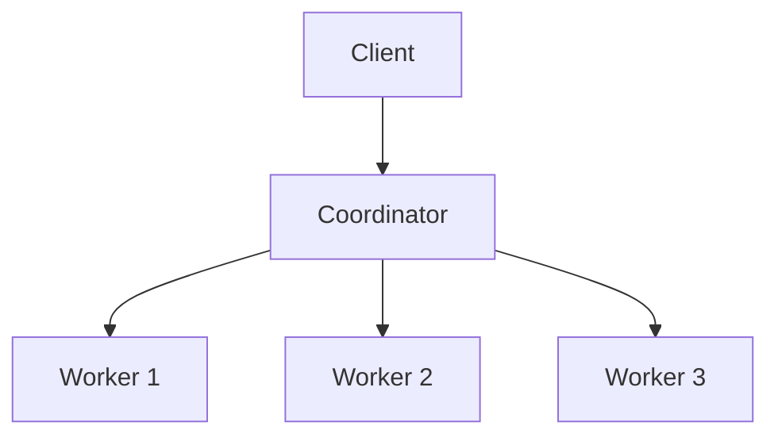
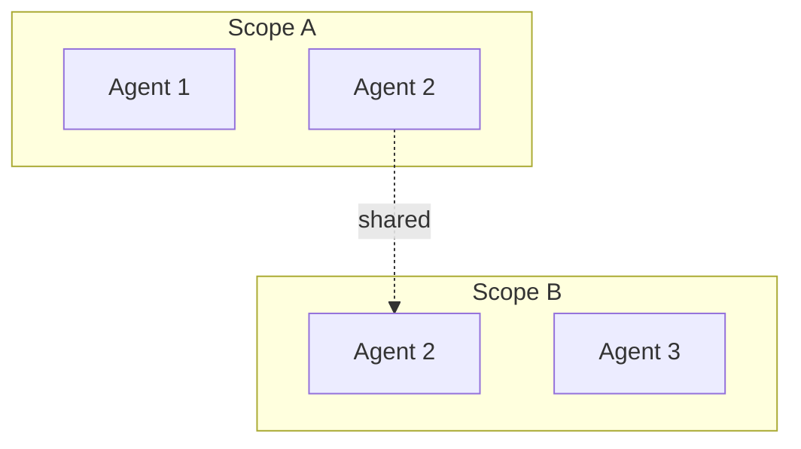
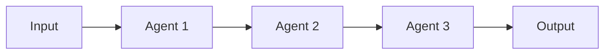

# Examples

Complete working examples demonstrating MAP patterns.
{: .fs-6 .fw-300 }

---

## Available Examples

| Example | Description | Concepts |
|:--------|:------------|:---------|
| [Simple Chat](./simple-chat.html) | Basic agent-to-agent messaging | Agents, messaging |
| [Task Queue](./task-queue.html) | Work distribution with scopes | Scopes, coordination |
| [Full Integration](./full-integration.html) | Complete end-to-end application | All concepts |

---

## Running Examples

All examples are available in the SDK repository:

```bash
git clone https://github.com/multi-agent-protocol/multi-agent-protocol.git
cd multi-agent-protocol/ts-sdk/examples
npm install
```

Each example has its own README with specific instructions.

---

## Example Patterns

### Pattern 1: Hub and Spoke

One coordinator, multiple workers:



### Pattern 2: Peer Collaboration

Agents collaborate through shared scopes:



### Pattern 3: Pipeline

Sequential processing through agents:



---

## Quick Start Template

Here's a minimal template to start a new MAP application:

```typescript
// server.ts
import { MAPServer } from "@multi-agent-protocol/sdk/server";
import { WebSocketServer } from "ws";

const server = new MAPServer({ name: "MyServer" });
const wss = new WebSocketServer({ port: 8080 });

wss.on("connection", (ws) => {
  server.accept(websocketToStream(ws)).start();
});

console.log("Server running on ws://localhost:8080");
```

```typescript
// agent.ts
import { AgentConnection } from "@multi-agent-protocol/sdk";

const agent = new AgentConnection(stream, {
  name: "MyAgent",
  role: "worker",
});

await agent.connect();

agent.onMessage(async (message) => {
  // Handle messages
});
```

```typescript
// client.ts
import { ClientConnection } from "@multi-agent-protocol/sdk";

const client = new ClientConnection(stream, { name: "MyClient" });
await client.connect();

const subscription = await client.subscribe({ eventTypes: ["*"] });
for await (const event of subscription) {
  // Handle events
}
```
