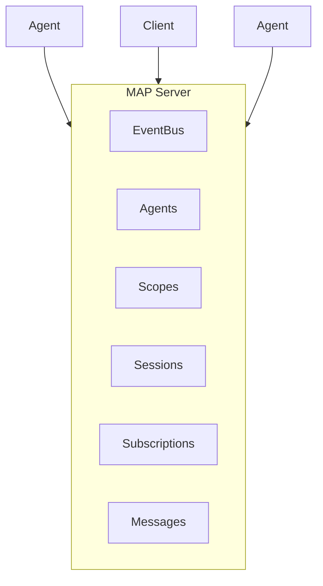

# Overview

The Multi-Agent Protocol (MAP) provides a standardized way to observe, coordinate, and route messages within multi-agent AI systems.
{: .fs-6 .fw-300 }

---

## What is MAP?

MAP is a **JSON-RPC based protocol** designed for multi-agent systems. Unlike protocols designed for single-agent interaction or peer-to-peer agent delegation, MAP provides a **window into** a multi-agent system with visibility into its internal structure, agent relationships, and message flows.

### MAP Provides

- **Observation** - Clients can subscribe to events and watch agent activity
- **Coordination** - Agents can form hierarchies, join scopes, and collaborate
- **Routing** - Messages flow through scopes and across federated systems
- **Transparency** - Full visibility into the system's internal state

---

## Protocol Landscape

Understanding where MAP fits in the AI protocol ecosystem:

| Protocol | Relationship | Visibility | Primary Use |
|:---------|:-------------|:-----------|:------------|
| **MCP** | Agent → Tool | N/A | Tool invocation |
| **ACP** | Client → Agent | Opaque | Single-agent sessions |
| **A2A** | Agent → Agent (peer) | Opaque | Cross-org delegation |
| **MAP** | Client → System | **Transparent** | Internal orchestration |

### When to Use MAP

{: .highlight }
Use MAP when you need **visibility and coordination** across multiple agents working together.

**Good fits for MAP:**
- Multi-agent orchestration systems
- Agent dashboards and monitoring
- Systems requiring audit trails
- Collaborative AI workflows
- Agent marketplaces and registries

**Not ideal for MAP:**
- Simple single-agent chat applications (use ACP)
- Pure tool invocation (use MCP)
- Cross-organization agent handoffs (use A2A)

---

## Core Concepts

### Three Participant Types

MAP defines three types of participants:

| Type | Role | Capabilities |
|:-----|:-----|:-------------|
| **Agent** | Worker that processes tasks | Register, join scopes, send/receive messages |
| **Client** | Observer and requester | Subscribe to events, query state, send messages |
| **Gateway** | Federation bridge | Route between MAP systems |

### Key Components

A MAP server manages these internal components:

- **EventBus** - Central event dispatcher for all system events
- **AgentRegistry** - Tracks registered agents and their state
- **ScopeManager** - Manages logical groupings (rooms, topics, projects)
- **SessionManager** - Handles connections and reconnection
- **SubscriptionManager** - Event filtering and delivery
- **MessageRouter** - Routes messages to agents and scopes

### Protocol Methods

The protocol defines **27 methods** across three tiers:

**Core (Required):**
- `map/connect` - Establish connection
- `map/disconnect` - Clean shutdown
- `map/send` - Send messages
- `map/subscribe` - Subscribe to events
- `map/unsubscribe` - Cancel subscriptions
- `map/agents/list` - List registered agents
- `map/agents/get` - Get agent details

**Structure (Recommended):**
- Agent lifecycle: `register`, `spawn`, `unregister`, `update`, `stop`, `suspend`, `resume`
- Scope management: `scopes/create`, `scopes/join`, `scopes/leave`
- Structure queries: `scopes/list`, `agents/children`

**Extensions (Optional):**
- Federation: `federation/connect`, `federation/route`
- Session management: `sessions/list`, `sessions/get`
- Steering: `map/inject`

---

## Architecture



---

## Key Features

### Real-time Streaming

Subscribe to events with backpressure support:

```typescript
const subscription = await client.subscribe({
  eventTypes: ["agent.*", "message.*"],
  agents: ["agent-123"]
});

for await (const event of subscription) {
  console.log(event.type, event.data);
}
```

### 4-Layer Permission System

Control visibility and actions at multiple levels:

1. **System** - Global server configuration
2. **Participant** - Per-connection permissions
3. **Scope** - Namespace-level access
4. **Agent** - Individual agent preferences

### Federation

Connect multiple MAP systems:

```typescript
// Gateway connects two MAP systems
const gateway = await GatewayConnection.connect(localServer, {
  name: "federation-gateway",
  remoteSystem: "https://remote-map.example.com"
});
```

### Causal Ordering

Events are delivered in dependency order, ensuring consistent state across clients.

---

## Next Steps

Ready to start building? Continue to the [Quickstart Guide](./quickstart.html).
