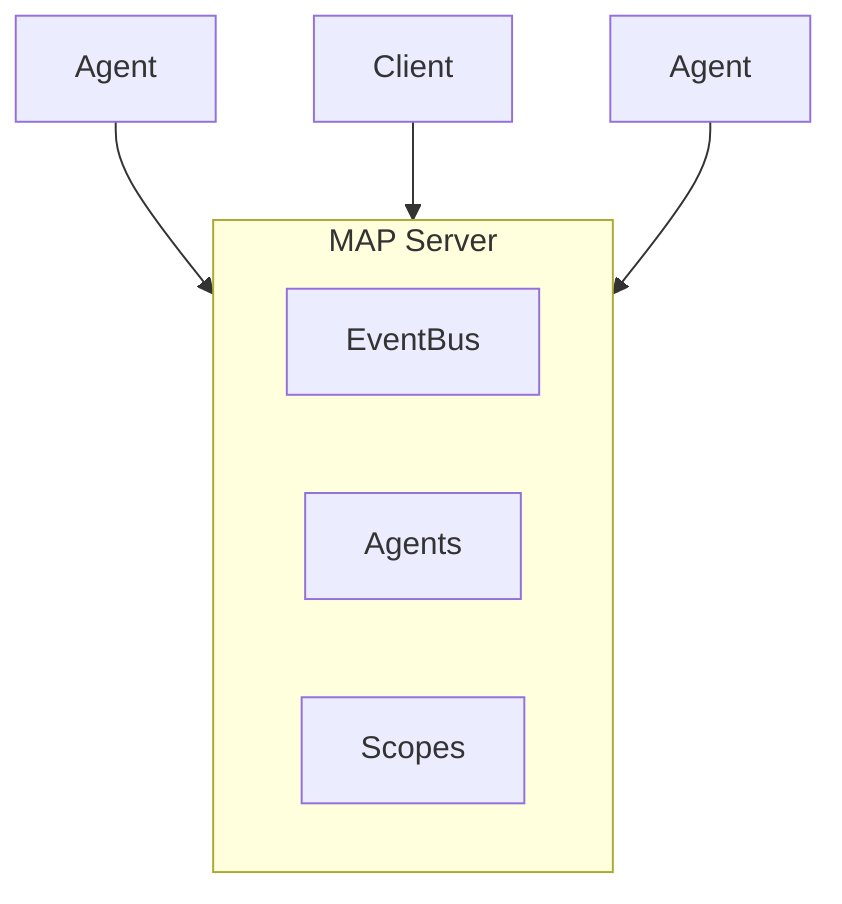

# Multi-Agent Protocol (MAP)
{: .fs-9 }

A JSON-RPC based protocol for observing, coordinating, and routing messages within multi-agent AI systems.
{: .fs-6 .fw-300 }

[Get Started](/multi-agent-protocol/getting-started/){: .btn .btn-primary .fs-5 .mb-4 .mb-md-0 .mr-2 }
[View on GitHub](https://github.com/multi-agent-protocol/multi-agent-protocol){: .btn .fs-5 .mb-4 .mb-md-0 }

---

## Why MAP?

Unlike protocols designed for single-agent interaction (ACP) or peer-to-peer agent delegation (A2A), MAP provides a **window into** a multi-agent system with visibility into its internal structure, agent relationships, and message flows.

{: .highlight }
MAP is the protocol for building **observable, coordinated** multi-agent systems.

### Key Features

| Feature | Description |
|:--------|:------------|
| **Real-time Streaming** | Subscribe to events with backpressure support |
| **Auto-reconnection** | Exponential backoff with subscription restoration |
| **Permission System** | 4-layer access control (system, participant, scope, agent) |
| **Federation** | Connect multiple MAP systems with envelope-based routing |
| **Causal Ordering** | Events released in dependency order |

---

## Protocol Landscape

| Protocol | Relationship | Visibility | Primary Use |
|:---------|:-------------|:-----------|:------------|
| MCP | Agent → Tool | N/A | Tool invocation |
| ACP | Client → Agent | Opaque | Single-agent sessions |
| A2A | Agent → Agent (peer) | Opaque | Cross-org delegation |
| **MAP** | Client → System | **Transparent** | Internal orchestration |

---

## Quick Example

```typescript
import { MAPServer } from "@multi-agent-protocol/sdk/server";
import { ClientConnection, AgentConnection } from "@multi-agent-protocol/sdk";

// Create a MAP server
const server = new MAPServer({ name: "MyServer" });

// Register an agent
const agent = new AgentConnection(stream, {
  name: "Worker",
  role: "processor"
});
await agent.connect();

// Subscribe to events from a client
const client = new ClientConnection(stream, { name: "Dashboard" });
await client.connect();

const subscription = await client.subscribe({
  eventTypes: ["agent.*"]
});

for await (const event of subscription) {
  console.log(event.type, event.data);
}
```

---

## Three Participant Types



| Type | Role | Capabilities |
|:-----|:-----|:-------------|
| **Agent** | Worker that processes tasks | Register, join scopes, send/receive messages |
| **Client** | Observer and requester | Subscribe to events, query state, send messages |
| **Gateway** | Federation bridge | Route between MAP systems |

---

## Protocol Methods

The protocol defines **27 methods** across three tiers:

### Core (Required)
`map/connect`, `map/disconnect`, `map/send`, `map/subscribe`, `map/unsubscribe`, `map/agents/list`, `map/agents/get`

### Structure (Recommended)
Agent lifecycle (`register`, `spawn`, `unregister`, `update`, `stop`, `suspend`, `resume`), scope management (`scopes/create`, `join`, `leave`), and structure queries

### Extensions (Optional)
Federation (`federation/connect`, `federation/route`), session management, and steering (`map/inject`)

---

## Getting Started

<div class="code-example" markdown="1">
**Installation**
```bash
npm install @multi-agent-protocol/sdk
```
</div>

Ready to build? Check out the [Getting Started Guide](/multi-agent-protocol/getting-started/) to run your first MAP server in 5 minutes.

---

## About

Multi-Agent Protocol is open source and available under the [MIT License](https://github.com/multi-agent-protocol/multi-agent-protocol/blob/main/LICENSE).

Created and maintained by the [sudocode](https://github.com/sudocode-ai) team.
