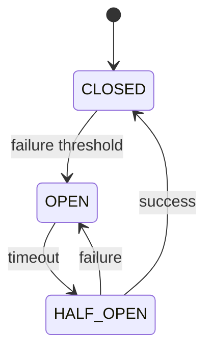
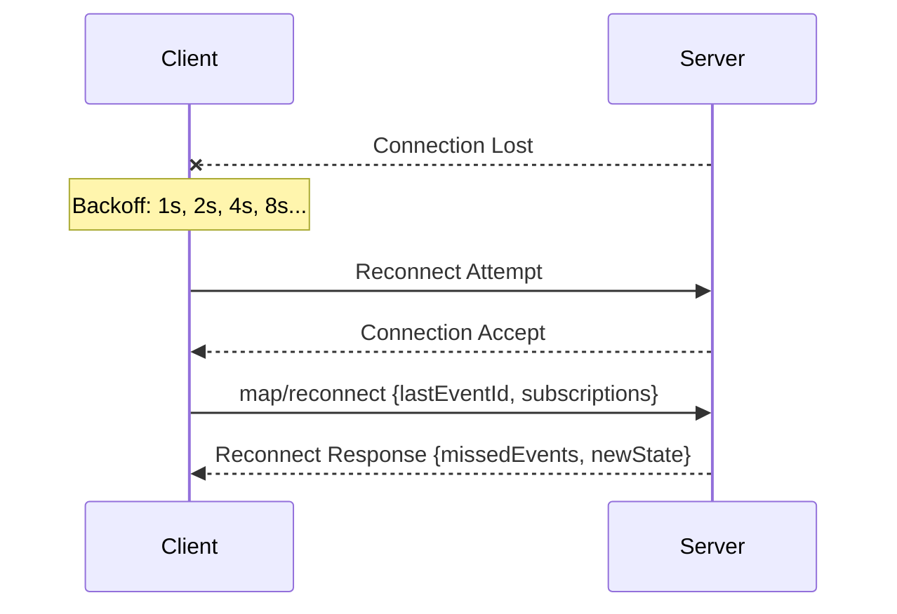

# Error Handling
{: .no_toc }

Error taxonomy, failure modes, and recovery mechanisms.
{: .fs-6 .fw-300 }

## Table of contents
{: .no_toc .text-delta }

1. TOC
{:toc}

---

## Design Goals

1. **Graceful degradation** - Partial failures don't cascade to total failure
2. **Clear error taxonomy** - Distinct error types with actionable codes
3. **Recovery semantics** - Well-defined reconnection and replay behavior
4. **Federation resilience** - Cross-system failures handled gracefully
5. **Observability** - Errors are traceable and debuggable

---

## Error Structure

```typescript
interface MAPError {
  code: number;                  // Numeric code
  category: MAPErrorCategory;
  message: string;               // Human-readable

  details?: {
    agentId?: string;
    messageId?: string;
    method?: string;
    retryable?: boolean;
    retryAfter?: number;         // Milliseconds
    recoveryHint?: string;
  };

  traceId?: string;
  timestamp?: number;
}

type MAPErrorCategory =
  | "protocol"      // Wire protocol violations
  | "auth"          // Authentication/authorization
  | "routing"       // Message delivery failures
  | "agent"         // Agent lifecycle errors
  | "resource"      // Resource exhaustion
  | "federation"    // Cross-system errors
  | "internal";     // Server internal errors
```

---

## Error Codes

### Protocol Errors (-32xxx)

JSON-RPC compatible error codes:

| Code | Name | Description |
|:-----|:-----|:------------|
| -32700 | PARSE_ERROR | Invalid JSON |
| -32600 | INVALID_REQUEST | Invalid request structure |
| -32601 | METHOD_NOT_FOUND | Method does not exist |
| -32602 | INVALID_PARAMS | Invalid method parameters |
| -32603 | INTERNAL_ERROR | Internal server error |

### Authentication Errors (1xxx)

| Code | Name | Description | Retryable |
|:-----|:-----|:------------|:----------|
| 1000 | AUTH_REQUIRED | Authentication required | Yes (with credentials) |
| 1001 | AUTH_FAILED | Invalid credentials | No |
| 1002 | AUTH_EXPIRED | Token expired | Yes (with refresh) |
| 1003 | PERMISSION_DENIED | Insufficient permissions | No |

### Routing Errors (2xxx)

| Code | Name | Description | Retryable |
|:-----|:-----|:------------|:----------|
| 2000 | AGENT_NOT_FOUND | Target agent doesn't exist | No |
| 2001 | AGENT_STOPPED | Target agent has stopped | No |
| 2002 | AGENT_BUSY | Target agent at capacity | Yes |
| 2003 | SCOPE_NOT_FOUND | Target scope doesn't exist | No |
| 2004 | NO_RECIPIENTS | No valid recipients | No |
| 2005 | PERMISSION_DENIED | Cannot message target | No |
| 2006 | DELIVERY_FAILED | Message delivery failed | Yes |
| 2007 | DELIVERY_TIMEOUT | Delivery timed out | Yes |

### Agent Lifecycle Errors (3xxx)

| Code | Name | Description | Retryable |
|:-----|:-----|:------------|:----------|
| 3000 | AGENT_EXISTS | Agent ID already registered | No |
| 3001 | INVALID_PARENT | Parent agent doesn't exist | No |
| 3002 | HIERARCHY_CYCLE | Would create cycle in hierarchy | No |
| 3003 | MAX_AGENTS_EXCEEDED | System at capacity | Yes |
| 3004 | INVALID_STATE | Invalid state transition | No |
| 3005 | SPAWN_FAILED | Child agent spawn failed | Yes |

### Resource Errors (4xxx)

| Code | Name | Description | Retryable |
|:-----|:-----|:------------|:----------|
| 4000 | RATE_LIMITED | Too many requests | Yes |
| 4001 | QUOTA_EXCEEDED | Resource quota exceeded | No |
| 4002 | BUFFER_OVERFLOW | Event buffer overflow | Yes |
| 4003 | MAX_SUBSCRIPTIONS | Subscription limit reached | No |
| 4004 | MESSAGE_TOO_LARGE | Payload exceeds limit | No |

### Federation Errors (5xxx)

| Code | Name | Description | Retryable |
|:-----|:-----|:------------|:----------|
| 5000 | PEER_UNREACHABLE | Cannot connect to peer | Yes |
| 5001 | PEER_TIMEOUT | Peer response timeout | Yes |
| 5002 | PEER_REJECTED | Peer rejected connection | No |
| 5003 | ROUTING_FAILED | Cross-system routing failed | Yes |

---

## Agent Failure Modes

### 1. Graceful Shutdown

```
Agent: sends shutdown intent
Server: drains queue, notifies parent, cleans up
Recovery: None needed (intentional)
```

### 2. Crash (Unexpected Termination)

```
Detection: Heartbeat timeout, process exit
Server: Marks stopped, notifies parent, orphan handling
Recovery: Restart with same ID or spawn replacement
```

### 3. Hang (Unresponsive)

```
Detection: Request timeout, no heartbeat
Server: Marks blocked, notifies parent
Recovery: Force restart or manual intervention
```

### 4. Error Loop (Repeated Failures)

```
Detection: Error rate threshold exceeded
Server: Circuit breaker, reduce routing
Recovery: Exponential backoff restart
```

---

## Orphan Handling

When an agent fails, its children and pending work must be handled:

```typescript
interface OrphanPolicy {
  tasks: "reassign" | "return_to_parent" | "fail" | "hold";
  children: "cascade_stop" | "reparent" | "orphan";
  messages: "drop" | "bounce" | "redirect";
}
```

### Default Policy

```typescript
const DEFAULT_ORPHAN_POLICY: OrphanPolicy = {
  tasks: "return_to_parent",
  children: "cascade_stop",
  messages: "bounce"
};
```

---

## Circuit Breakers

Per-agent circuit breakers prevent cascading failures:

```typescript
interface CircuitBreakerState {
  agentId: string;
  state: "closed" | "open" | "half-open";

  // Thresholds
  failureThreshold: number;    // Failures to open
  successThreshold: number;    // Successes to close
  timeout: number;             // Time before half-open

  // Counters
  failureCount: number;
  successCount: number;
  lastFailure: number;
  lastStateChange: number;
}
```

### Circuit Breaker States



---

## Retry Policies

```typescript
interface RetryPolicy {
  maxAttempts: number;
  backoff: {
    type: "exponential" | "linear" | "constant";
    initial: number;        // Initial delay (ms)
    max: number;            // Maximum delay (ms)
    multiplier?: number;    // For exponential
  };
  retryableErrors: number[];
  nonRetryableErrors: number[];
}

// Default policy
const DEFAULT_RETRY: RetryPolicy = {
  maxAttempts: 3,
  backoff: {
    type: "exponential",
    initial: 1000,
    max: 30000,
    multiplier: 2
  },
  retryableErrors: [2002, 2007, 4000, 5001],
  nonRetryableErrors: [1001, 1003, 2000, 3002]
};
```

---

## Reconnection Protocol



---

## Distributed Tracing

All errors include tracing context:

```typescript
interface TracingContext {
  traceId: string;      // Unique trace identifier
  spanId: string;       // Current span
  parentSpanId?: string;
  baggage?: Record<string, string>;
}
```

Errors propagate tracing information:

```typescript
{
  "error": {
    "code": 2006,
    "category": "routing",
    "message": "Delivery failed: agent_001 not responding",
    "details": {
      "agentId": "agent_001",
      "retryable": true,
      "retryAfter": 5000
    },
    "traceId": "abc123def456"
  }
}
```

---

## Next Steps

- [Authentication](./authentication.html) - Auth error handling
- [Federation](./federation.html) - Cross-system error handling
