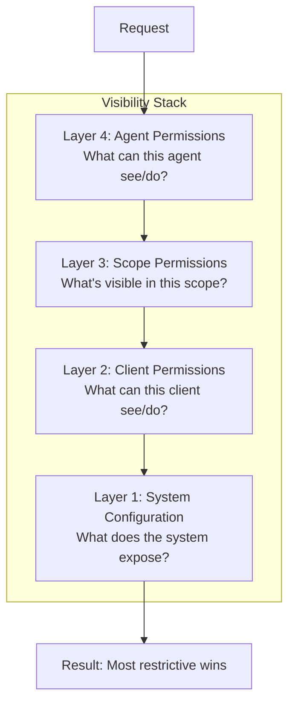

# Visibility & Permissions
{: .no_toc }

The 4-layer permission model controlling visibility and actions.
{: .fs-6 .fw-300 }

## Table of contents
{: .no_toc .text-delta }

1. TOC
{:toc}

---

## Design Principles

1. **Layered control** - Permissions are checked at multiple levels, most restrictive wins
2. **Explicit over implicit** - Default to restricted, explicitly grant access
3. **Separation of concerns** - Client permissions vs agent permissions are distinct
4. **Flexibility** - System implementations can choose how strict to be

---

## Visibility Layers



**Evaluation:** Check Layer 1 → Layer 2 → Layer 3 → Layer 4. All layers must allow.

---

## Layer 1: System Configuration

Global system-level exposure settings:

```typescript
interface MAPSystemConfig {
  exposure: {
    agents: {
      publicByDefault: boolean;
      publicAgents: string[];      // Always visible
      hiddenAgents: string[];      // Never visible externally
    };
    events: {
      exposedTypes: string[];      // Event types to expose
      hiddenTypes: string[];       // Event types to hide
    };
    scopes: {
      publicByDefault: boolean;
      publicScopes: string[];
      hiddenScopes: string[];
    };
  };

  limits: {
    maxConnections: number;
    maxConnectionsPerClient: number;
    maxSubscriptionsPerConnection: number;
  };

  // Permissions for unauthenticated connections
  anonymousPermissions: MAPClientPermissions;
}
```

---

## Layer 2: Client Permissions

Per-client permissions granted during authentication:

```typescript
interface MAPClientPermissions {
  visibility: {
    // What can this client see?
    agents: "all" | "none" | { include: string[] } | { roles: string[] };
    scopes: "all" | "none" | { include: string[] };
    events: "all" | "none" | { include: string[] };
    structure: boolean;  // Can see hierarchy/relationships
  };

  actions: {
    // What can this client do?
    sendMessages: boolean | { to: MAPAddress[]; priorities: string[] };
    registerAgents: boolean | { roles: string[]; maxAgents: number };
    unregisterAgents: boolean | { own: boolean; any: boolean };
    createScopes: boolean;
    deleteScopes: boolean | { own: boolean };
    modifyScopes: boolean | { own: boolean; member: boolean };
    steerAgents: boolean | { agents: string[]; methods: string[] };
    federationConnect: boolean;
  };

  limits: {
    subscriptions: number;
    messagesPerMinute: number;
    agentsRegistered: number;
    scopesCreated: number;
  };
}
```

### Permission Presets

```typescript
// Observer: read-only access
const OBSERVER_PERMISSIONS: MAPClientPermissions = {
  visibility: {
    agents: "all",
    scopes: "all",
    events: "all",
    structure: true
  },
  actions: {
    sendMessages: false,
    registerAgents: false,
    unregisterAgents: false,
    createScopes: false,
    deleteScopes: false,
    modifyScopes: false,
    steerAgents: false,
    federationConnect: false
  },
  limits: {
    subscriptions: 10,
    messagesPerMinute: 0,
    agentsRegistered: 0,
    scopesCreated: 0
  }
};

// Operator: full access
const OPERATOR_PERMISSIONS: MAPClientPermissions = {
  visibility: {
    agents: "all",
    scopes: "all",
    events: "all",
    structure: true
  },
  actions: {
    sendMessages: true,
    registerAgents: true,
    unregisterAgents: { own: true, any: true },
    createScopes: true,
    deleteScopes: { own: true },
    modifyScopes: { own: true, member: true },
    steerAgents: true,
    federationConnect: true
  },
  limits: {
    subscriptions: 100,
    messagesPerMinute: 1000,
    agentsRegistered: 100,
    scopesCreated: 50
  }
};
```

---

## Layer 3: Scope Permissions

Per-scope visibility and access control:

```typescript
interface MAPScopePermissions {
  // Who can discover this scope exists?
  discoverability: "public" | "members" | "owners";

  // Who can see messages in this scope?
  messageVisibility: "public" | "members" | "participants";

  // Who can join this scope?
  joinPolicy: "open" | "invite" | "owner-invite" | "closed";

  // Who can send messages to this scope?
  sendPolicy: "anyone" | "members" | "owners";

  // Inherit from parent scope?
  inheritFrom?: string;
}
```

### Scope Examples

**Public channel:**
```typescript
{
  discoverability: "public",
  messageVisibility: "members",
  joinPolicy: "open",
  sendPolicy: "members"
}
```

**Private room:**
```typescript
{
  discoverability: "members",
  messageVisibility: "members",
  joinPolicy: "owner-invite",
  sendPolicy: "members"
}
```

**Broadcast channel:**
```typescript
{
  discoverability: "public",
  messageVisibility: "public",
  joinPolicy: "closed",
  sendPolicy: "owners"
}
```

---

## Layer 4: Agent Permissions

Individual agent visibility and capabilities:

```typescript
interface MAPAgentPermissions {
  canSee: {
    // What agents can this agent see?
    agents: "all" | "hierarchy" | "scoped" | "direct" | { include: string[] };

    // What scopes can this agent see?
    scopes: "all" | "member" | { include: string[] };

    // How much structure is visible?
    structure: "full" | "local" | "none";
  };

  canMessage: {
    // Who can this agent send messages to?
    agents: "all" | "hierarchy" | "scoped" | { include: string[] };
    scopes: "all" | "member" | { include: string[] };
  };

  acceptsFrom: {
    // Who can send messages to this agent?
    agents: "all" | "hierarchy" | "scoped" | { include: string[] };
    clients: "all" | "none" | { include: string[] };
    systems: "all" | "none" | { include: string[] };
  };

  capabilities: {
    registerAgents: boolean;
    createScopes: boolean;
    steerAgents: boolean;
  };
}
```

### Agent Visibility Modes

| Mode | Description |
|:-----|:------------|
| `all` | Can see all agents in the system |
| `hierarchy` | Can see parent, siblings, and descendants |
| `scoped` | Can see agents in shared scopes |
| `direct` | Can only see agents it directly interacts with |

---

## Permission Resolution

```typescript
function canPerformAction(
  client: MAPClient,
  agent: MAPAgent | null,
  action: MAPAction
): boolean {
  // Layer 1: System allows?
  if (!systemAllows(action)) {
    return false;
  }

  // Layer 2: Client permissions allow?
  if (!clientAllows(client, action)) {
    return false;
  }

  // Layer 3: Scope permissions allow?
  if (action.scope && !scopeAllows(action.scope, client, agent, action)) {
    return false;
  }

  // Layer 4: Agent permissions allow?
  if (agent && !agentAllows(agent, action)) {
    return false;
  }

  return true;
}
```

### Resolution Example

```
Client wants to send message to agent_B in scope_X:

Layer 1: System
  ✓ Messages enabled
  ✓ scope_X not hidden

Layer 2: Client
  ✓ sendMessages: true
  ✓ scope_X in visible scopes

Layer 3: Scope
  ✓ sendPolicy: "members"
  ✓ Client is member

Layer 4: Agent (agent_B)
  ✓ acceptsFrom.clients: "all"

Result: ALLOWED
```

---

## Dynamic Permissions

Permissions can change during runtime:

```typescript
// Server updates client permissions
{
  "method": "map/permissions/update",
  "params": {
    "clientId": "client_001",
    "permissions": {
      "actions": {
        "steerAgents": true
      }
    }
  }
}

// Client receives notification
{
  "method": "map/permissions.changed",
  "params": {
    "changes": {
      "actions.steerAgents": {
        "previous": false,
        "current": true
      }
    }
  }
}
```

---

## Security Considerations

{: .warning }
> Always follow the principle of least privilege. Grant only the minimum permissions required for the task.

### Best Practices

1. **Start restrictive** - Begin with minimal permissions, expand as needed
2. **Audit regularly** - Review granted permissions periodically
3. **Use scopes** - Isolate sensitive operations in restricted scopes
4. **Layer defense** - Don't rely on a single permission layer
5. **Log access** - Record permission checks for security auditing

---

## Next Steps

- [Federation](./federation.html) - Cross-system permissions
- [Authentication](./authentication.html) - How permissions are granted
